# Reef Atlas

Coral reefs change between the few times anyone surveys them. Reef Atlas shows
what happened in between (heat, storms, starfish, fishing) at reefs with long
public records, and marks every stretch nobody observed. Built for OwlHacks 2026.

**Live:** [reefatlas.us](https://reefatlas.us) ·
**Data explorer:** [reefatlas.us/data](https://reefatlas.us/data) ·
**API:** [`/api/reef-data`](https://reefatlas.us/api/reef-data?dataset=risk&year=2023)

## What you can do

- **Explore the globe.** 2,720 reefs coloured by peak heat stress for any year
  from 1985 to 2025, or by a forecast for 2027–2031.
- **Open a flagship reef.** Moorea (French Polynesia), Lizard Island (Great
  Barrier Reef) and Soneva Fushi (Maldives) each open an evidence timeline of
  field surveys, reef sensors, satellite heat stress and cyclone tracks. Each
  decline between surveys is listed with what else was happening at the time,
  never a claimed cause.
- **Walk a reef in 3D.** At Soneva Fushi, step into real 3D scans of a reef plot
  and switch between survey dates.
- **Dive in Florida.** Fly down the reef tract and dive at one of nine sites,
  where heat, storms, lionfish and fishing shape the underwater scene.
- **Ask the reef.** Press `V` and ask by voice or text, in English or Spanish.
  The agent answers only from the reef data and can move the page ("take me to
  Moorea", "go to August 2023").
- **Browse the data.** Page through 137,764 records at `/data` or query them
  through the API.

## Real, modelled or simulated

Every number on screen is labelled ● observed, ◌ model output or ⊘ simulated.

| Label | Data |
| --- | --- |
| ● Observed | Field surveys (Moorea LTER, AIMS), reef temperature sensors, NOAA satellite heat stress, cyclone and hurricane tracks, lionfish records, Soneva 3D scans, global heat history 1985–2025 (years that are estimated are marked as such) |
| ◌ Model | Heat forecast 2027–2031, bleaching risk 2021–2025, and the demo bleaching model in the Florida reef scene |
| ⊘ Simulated | Fishing and vessel activity at the Florida sites (seeded, shaped by real seasons) |

Sources, licences and limits: [flagship data inventory](docs/data-inventory.md)
and the [full data table](#1-what-is-real-and-what-is-simulated).

## How it works

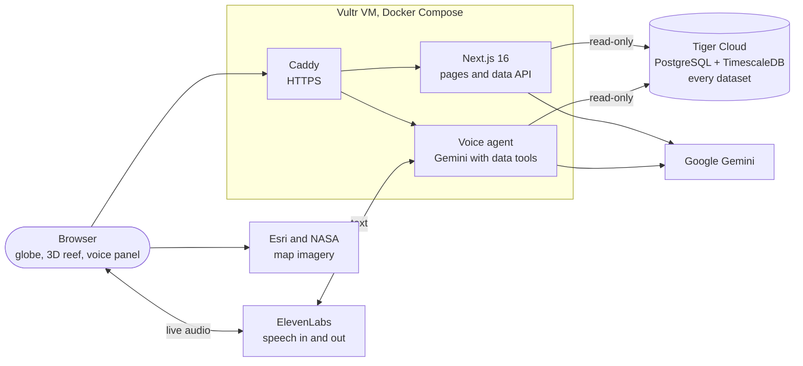

- **One database.** Every dataset lives in Tiger Cloud (schema `reef_data`).
  The server reads it with a read-only role and the browser gets it through
  small JSON routes. The app ships no data files.
- **Voice.** ElevenLabs handles listening, turn-taking and speaking. Our voice
  service runs the Gemini agent, whose tools query Tiger and move the page. API
  keys never reach the browser.
- **Deploys.** Every push to `main` builds a Docker image in GitHub Actions and
  releases it to the VM, rolling back automatically if the health check fails.

## The experience

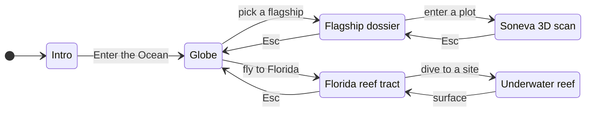

The voice agent makes the same moves as a click. Deep links jump straight in:
`#flagship=moorea`, `#splat=ootsl1`, `#reef=looe-key`.

## Data pipeline

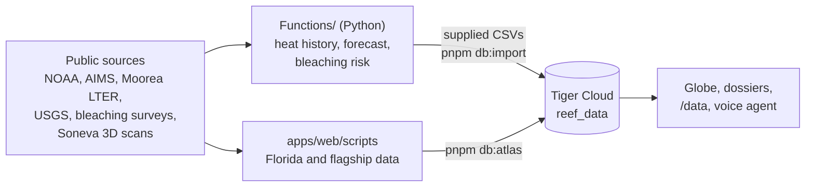

Each import runs in one transaction and commits only if Tiger reads back exactly
what went in (same SHA-256). `pnpm db:verify` repeats the check at any time.

## Quick start

Needs Node 24 and pnpm 11.

```bash
cd apps/web
pnpm install --frozen-lockfile
pnpm dev    # http://localhost:3000
```

Put `TIGER_DATABASE_URL` (the read-only role) in `apps/web/.env.local`. Without
it the page loads but shows "Reef data is temporarily unavailable". Every
variable and script is in [section 8](#8-local-development).

## Technical reference

Everything below is the full detail: every data source, the frontend, the voice
agent, the Tiger Cloud schema and import, the API, and deployment.

### Contents

1. [What is real and what is simulated](#1-what-is-real-and-what-is-simulated)
2. [System architecture](#2-system-architecture)
3. [Repository layout](#3-repository-layout)
4. [Frontend](#4-frontend)
5. [Voice agent](#5-voice-agent)
6. [TigerData layer](#6-tigerdata-layer)
7. [Deployment](#7-deployment)
8. [Local development](#8-local-development)
9. [Testing and verification](#9-testing-and-verification)

Deeper references: [`apps/web/database/README.md`](apps/web/database/README.md) (TigerData),
[`infra/README.md`](infra/README.md) (operations),
[`Functions/README.md`](Functions/README.md) (Python models).

### 1. What is real and what is simulated

| Data | Source | Kind |
| --- | --- | --- |
| Moorea and Lizard Island reef surveys | Moorea Coral Reef LTER, AIMS | observed |
| Soneva Fushi 3D scans | wildflow/soneva-corals | observed |
| Heat stress, storms, sea temperature, lionfish | NOAA, NASA, USGS | observed |
| Global heat history 1985–2025 | Python models in `Functions/` | observed / estimated |
| Heat forecast and bleaching risk | Python models in `Functions/` | model |
| Bleaching probability in the 3D reef | demo model | model |
| Florida fishing and vessel activity | seeded simulation | **simulated** |

Flagship source details: [`docs/data-inventory.md`](docs/data-inventory.md).

### 2. System architecture

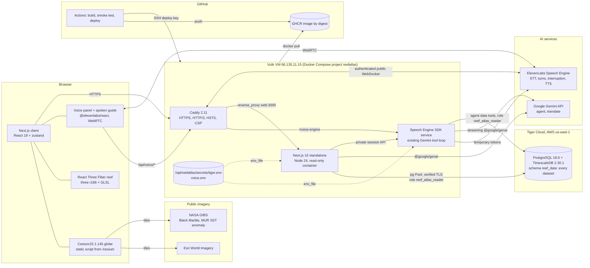

The browser uses our origin for app data and ElevenLabs for WebRTC audio. Caddy terminates TLS, adds the security
headers, compresses responses, and proxies to the Next.js server. The page shell
and scripts are static. All data comes from Tiger at request time through small
JSON routes: the Florida bundle is preloaded in the page head and fetched once
before the experience starts, flagship documents load when opened, and the world
heat layer loads one year at a time. Each server process keeps a read for five
minutes, and browsers may keep a response for 60 seconds.

Four kinds of request reach the server:

- `/api/atlas/*` (Florida bundle, flagship documents, world reef index, heat by
  year), `/data` and `/api/reef-data` query Tiger as a read-only database role.
- `/api/voice/*` calls Gemini and ElevenLabs with API keys held only on the
  server.
- `/api/health` is the liveness probe.

API keys stay on the server. The browser receives a temporary conversation token
and a per-session capability for page context and actions. CSP permits the
ElevenLabs API and WebRTC hosts.

### 3. Repository layout

```text
apps/web/                      Next.js 16 app (the only deployable)
  src/app/
    page.tsx                   the 3D experience, held by FloridaGate until its data arrives
    data/page.tsx              /data explorer (server component, reads Tiger)
    api/atlas/                 florida, documents/[group]/[name], world, heat (read Tiger)
    api/reef-data/route.ts     GET /api/reef-data (route handler, reads Tiger)
    api/voice/                 ask, session, translate (Gemini, Speech Engine)
    api/health/route.ts        liveness probe for Docker and Caddy
    globals.css, interface.css base rules, then the glass interface layer
  src/features/                experience, globe, dive, reef, hud, timeline, intro
  src/features/atlas/          world view, flagship dossier, evidence timeline, side cards
  src/features/splat/          Soneva 3D surveys (Spark Gaussian splats in React Three Fiber)
  src/features/voice/          VoiceAgent + React SDK, Narrator, narration bridge, i18n
  src/lib/                     data access (Florida data filled from /api/atlas/florida), atlasClient
                               (browser reads of /api/atlas), time, demo model, store, narrative,
                               navigation (page moves), voiceActions (UiAction types)
  src/lib/server/              server-only: pg pool, atlas and dataset queries
  src/server/                  server-side (imported only by route handlers): Gemini
                               client, agent loop and tools, ReefData interface and
                               its Tiger (SQL) implementation
  database/                    SQL migrations 001–003, dataset allowlist, atlas read/load code,
                               CSV rebuilder, filters, tests, docs
  scripts/                     copy-cesium, build-data, import-tiger, import-atlas,
                               provision-tiger-reader, fetch-flagships, prepare-splats,
                               analyze-soneva, build-flagships
  public/splats/soneva/        SPZ files for two Soneva plots, four dates each
  Dockerfile                   multi-stage standalone image, non-root runtime
data/raw/                      raw NOAA CRW CSVs, HURDAT2, USGS lionfish JSON; flagship sources
                               (mcr, aims, soneva, ibtracs, crw weekly) with SHA-256 in sources.json
data/build/atlas/              pipeline output loaded into Tiger by `pnpm db:atlas` (ignored by Git)
docs/data-inventory.md         verified inventory of every flagship data source
Functions/                     Python models: heat history, heat forecast, bleaching risk
processed/                     model outputs (CSV); charts/ holds the model charts
infra/                         compose.yaml, Caddyfile, release scripts, tests
.github/workflows/deploy.yml   build, smoke test and deploy on push to main
```

### 4. Frontend

#### 4.1 Experience state machine

The whole experience is one zustand store (`src/lib/store.ts`). A `phase` field
drives which scene is mounted and what the camera does. A second field,
`crossing`, drives the water transition between the globe and the reef.

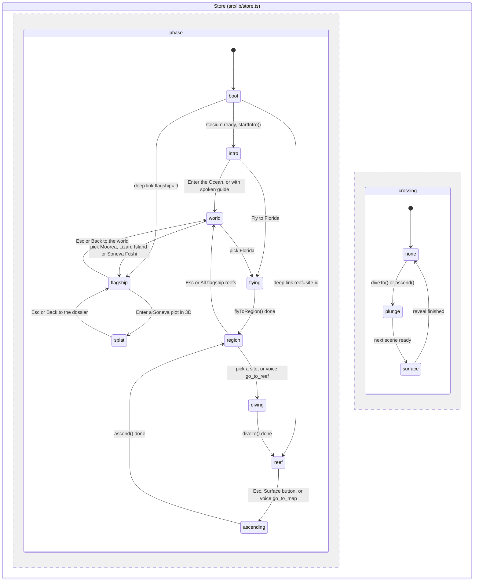

The two regions run concurrently. `crossing` starts during `diving` or `reef`
and finishes after the phase has changed. What each transition does in the code:

- **boot → intro.** `globeController.startIntro()` runs once Cesium has loaded.
  The reef tract draws itself as a filament of light and the city lights fade in.
- **region.** Globe input is enabled. `ReefView` is preloaded with a dynamic
  `import()` so the dive does not wait on the download.
- **diving → reef.** Cesium flies to the site and waits for high-zoom tiles
  (at most 1.3 s). It sets `crossing = plunge` and then `phase = reef`.
- **reef.** `ReefView` mounts. After 1.2 s the globe sets
  `viewer.useDefaultRenderLoop = false` and hides its canvas, so the GPU renders
  only the reef.
- **plunge → surface.** `DiveOverlay` is a pure CSS animation on the compositor
  thread. It keeps moving while the reef compiles its shaders. It reveals the
  next scene once it is ready: the reef after `ReadySignal` has counted three
  rendered frames, or the globe when the phase is `ascending` or `region`.
- **ascending → region.** The reverse: cover with water, restore the globe's
  render loop, fly back up.
- **Voice moves.** The voice agent's page actions use the same store calls as a
  click. `go_to_reef` from inside another reef first ascends, waits for
  `phase = region`, and then dives (`goToReef` in `src/lib/navigation.ts`).
- **Reduced motion.** It follows the OS `prefers-reduced-motion` setting (there
  is no in-app switch). When on, camera flights become instant cuts. The
  `motion` library gets `MotionConfig reducedMotion="always"`, so interface
  transitions keep their opacity fades but drop movement.

#### 4.2 Rendering stack

| Concern | Implementation |
| --- | --- |
| Globe | CesiumJS loaded as a static script (`/cesium/Cesium.js`, copied by `scripts/copy-cesium.mjs` before `dev` and `build`). This keeps Cesium's workers and assets out of the bundler. `GlobeView` is `next/dynamic` with `ssr: false`. |
| Imagery | Natural Earth II (bundled with Cesium), Esri World Imagery by day, NASA Black Marble by night, and the NASA MUR SST anomaly for the timeline date (only dates the GIBS capabilities list, from 2019-07-23). |
| Reef scene | React Three Fiber 9 with drei and postprocessing. Spur-and-groove terrain from deterministic value noise, instanced procedural coral taxa, fish schools, caustics, Snell's window, and silhouettes of surface traffic. |
| Shared uniforms | `features/reef/env.ts` keeps one set of uniform objects used by every reef material. `EnvDriver` recomputes the data-driven target (DHW, storm, SST) when the site or date changes, and eases toward it every frame. |
| Labels | 3D components publish world-space anchors. A plain DOM layer (`LabelLayer`) projects them with the live camera each frame, so text stays crisp and accessible. |
| Time | A float of days since 2016-01-01 UTC (`src/lib/time.ts`), clamped to 2016-01-01 … 2024-12-31. The default is 2023-08-20, the peak of the 2023 Florida marine heatwave. |
| Interface | Geist and Geist Mono (`next/font`). Frosted-glass panels live in `interface.css`, which is loaded after `globals.css`. Panel motion uses one critically damped spring (`src/lib/ui.ts`) and full `transform` strings, so animations stay on the compositor while the reef scene loads. |

#### 4.3 Client domain model

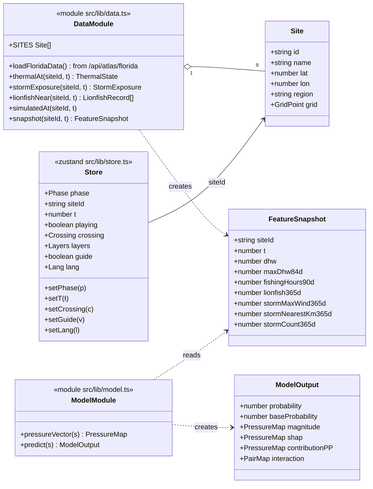

`PressureMap` is `Record<Pressure, number>` over heat, fishing, lionfish and
storm. `PairMap` covers the three interaction pairs. `Crossing` is
`none | plunge | surface`. `Lang` is `en | es`. `guide` switches the spoken
narration on.

`snapshot(siteId, t)` combines every pressure at one moment: it interpolates
the weekly CRW samples, takes the maximum DHW over the previous 84 days,
aggregates the simulated AIS series, counts lionfish records within 25 km in the
previous 365 days, and finds the strongest storm within 150 km. It mirrors one
row of the planned `reef_feature_snapshots` table, so a real backend can replace
it without touching the UI.

The functions stay synchronous. `FloridaGate` holds the experience until
`/api/atlas/florida` has answered (the page head preloads it, and Cesium starts
loading at the same time), then `setFloridaData` fills the module's live exports.
If Tiger cannot be reached the page shows "Reef data is temporarily unavailable"
with a retry button, instead of any fallback data.

#### 4.4 Offline data pipeline

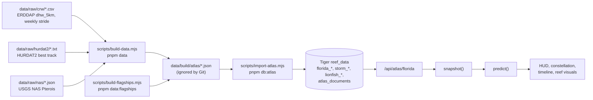

`build-data.mjs` computes haversine distances from each site to every
hurricane fix and lionfish record. It seeds the simulated AIS series so the demo
is deterministic, and writes `meta.json` with the provenance of each source.
The build output is only a staging area: `pnpm db:atlas` loads it into Tiger in one
transaction, reads every dataset back through the app's own read code, and
refuses to commit unless the read-back is identical to what it loaded.

### 5. Voice agent

Ask the reef by voice or text (`V` to start/end voice, `Esc` to close), in
English or Spanish. The existing Gemini agent and all data/page tools remain.

Browser `@elevenlabs/react` → ElevenLabs Speech Engine → Vultr's authenticated
WebSocket endpoint → Gemini and existing tools → streamed text back through
Speech Engine. ElevenLabs owns STT, turn-taking, interruption, TTS and playback.

`VoiceAgent` uses `ConversationProvider` and a temporary WebRTC conversation
token. The server-side TypeScript SDK attaches to `/ws` in the `speech` service;
Caddy exposes it at `/voice-engine`. The browser sends current reef, timeline,
layers and language through `/api/voice/session`, and polls that session for
validated UI actions and tool traces. Actions still call `runAction`.

`streamAgent` retains the existing prompt and six-turn tool loop. It streams
Gemini text immediately, preserves function responses and thought signatures,
and passes Speech Engine's abort signal to Gemini. Aborted turns cannot publish
pending page actions. Transient retries happen only before the first chunk, so
partial speech is never replayed by a retry.

Typed questions use `/api/voice/ask` when disconnected, including when microphone
permission or Speech Engine is unavailable. In an active conversation they use
`sendUserMessage`. The optional scene guide and replay use the same Speech Engine
session; the guide starts muted and may request microphone permission. Narrator
still maintains its screen-reader live region and Spanish caption translations.

Setup, public WebSocket routing, secrets and live verification steps are in
[Speech Engine deployment](infra/README.md#speech-engine-gemini-remains-the-agent).

#### 5.1 Tools

| Tool | Kind | Source | Returns |
| --- | --- | --- | --- |
| `get_thermal_summary(site_id, from, to)` | data | NOAA CRW, observed | peak DHW and date, weeks with DHW ≥ 4 and ≥ 8, highest alert level, mean SST, max anomaly, latest values |
| `get_storms_near(site_id, from, to, max_km = 150)` | data | HURDAT2, observed | storms whose closest approach falls in range, nearest first |
| `get_lionfish_near(site_id, from, to, radius_km = 25)` | data | USGS NAS, observed | count, first and latest date, nearest distance, count per year |
| `get_activity(site_id, from, to)` | data | **simulated** AIS / SAR | fishing hours, vessel hours, SAR detections, unmatched SAR |
| `compare_sites(metric, from, to)` | data | any of the above | all nine sites ranked by `max_dhw`, `weeks_dhw_at_least_4`, `lionfish_sightings`, `storm_passes` or `fishing_hours` |
| `get_flagship_evidence(flagship_id, from_year?, to_year?)` | data | flagship dossiers in Tiger (field, sensor, satellite, track, reported, derived) | survey values with dates, heat peaks, cyclones, reported causes, declines with what co-occurred, gaps, what is missing |
| `go_to_flagship(flagship_id)` / `go_to_world()` | page | – | open Moorea, Lizard Island, Soneva Fushi or Florida; pull back to the globe |
| `set_flagship_date(date)` | page | – | move the dossier's evidence timeline cursor |
| `go_to_reef(site_id)` | page | – | dive to one of the nine sites |
| `go_to_map()` | page | – | rise back to the map |
| `set_date(date)` | page | – | move the timeline (2016-01-01…2024-12-31) |
| `set_layer(layer, on)` | page | – | `sst`, `storms` or `lionfish` |
| `set_playing(playing)` | page | – | play or pause time |

#### 5.2 Voice API

| Route | Purpose |
| --- | --- |
| `POST /api/voice/session` | Mint temporary conversation token and browser session capability |
| `GET /api/voice/session?after=` | Read new action/trace events using the session capability |
| `PATCH /api/voice/session` | Update page context or request scripted scene narration |
| `DELETE /api/voice/session` | End and release the session |
| `POST /api/voice/ask` | Typed fallback: `{ question, ...context }` → `{ answer, trace, actions }` |
| `POST /api/voice/translate` | Translate the existing scripted guide captions |

API keys are server-only. Session updates require the random capability returned
at creation, and upstream WebSockets require ElevenLabs' signed JWT. Public token
creation and typed questions retain the app's existing lack of user authentication
and rate limiting.

### 6. TigerData layer

Tiger Cloud service `db-49612` (PostgreSQL 18.6, TimescaleDB 2.30.1, AWS
us-east-1) holds every dataset the app shows, in schema `reef_data`: the five
supplied CSVs (migrations 001 and 002) and the Florida and flagship data that used
to ship as JSON (migration 003). Full rationale, role setup, and runbook:
[`apps/web/database/README.md`](apps/web/database/README.md).

#### 6.1 Schema

```mermaid
erDiagram
    reefs ||--o{ bleaching_risk : "risk per year"
    reefs ||--o{ reef_stress : "surveys"
    reefs ||--o{ heat_history : "peak DHW per year"
    reefs ||--o{ heat_forecast : "forecast per year"
    heat_forecast_validation ||--o{ heat_forecast : "skill of (model, horizon)"
    florida_sites ||--o{ florida_thermal : "weekly CRW"
    florida_sites ||--o{ storm_site_passes : "closest approach"
    storms ||--o{ storm_fixes : "best track"
    storms ||--o{ storm_site_passes : ""
    lionfish_records ||--o{ lionfish_site_distances : ""
    florida_sites ||--o{ lionfish_site_distances : ""
    florida_sites ||--o{ florida_simulated_activity : "SIMULATED"

    reefs {
        integer reef_id PK "source reef ID, > 0"
        float8 latitude "-90 to 90"
        float8 longitude "-180 to 180"
    }
    bleaching_risk {
        integer source_row PK "CSV data-record ordinal"
        integer reef_id FK "UNIQUE with year"
        integer year "2021 to 2025"
        float8 peak_dhw ">= 0"
        float8 p_significant_bleaching "0 to 1, model output"
        text risk_band "none, watch, significant, severe"
        boolean beyond_training_dhw
    }
    reef_stress {
        integer source_row PK "CSV data-record ordinal"
        integer reef_id FK
        integer year "2013 to 2020"
        date window_start
        date window_end ">= window_start"
        float8 hard_coral_cover_pct "0 to 100, nullable"
        float8 max_dhw
        integer days_bleaching_alert
    }
    heat_history {
        integer source_row PK
        integer reef_id FK "UNIQUE with year"
        text ocean "as supplied, per row"
        integer year "1985 to 2025, no 2003"
        float8 peak_dhw ">= 0"
        text peak_dhw_source "observed or estimated"
    }
    heat_forecast {
        integer source_row PK
        integer reef_id FK "UNIQUE with year"
        integer year "2027 to 2031"
        integer horizon "= year - 2026"
        float8 forecast_peak_dhw "between p10 and p90"
        float8 peak_dhw_p10
        float8 peak_dhw_p90
        float8 p_dhw_over_8 "<= p_dhw_over_4"
        text model FK "with horizon"
    }
    heat_forecast_validation {
        integer source_row PK
        text model "UNIQUE with horizon"
        integer horizon "1 to 5"
        float8 mae_dhw
        float8 auc_dhw8
    }
    florida_sites {
        text site_id PK
        integer tract_order "UNIQUE"
        float8 crw_latitude "5 km pixel centre"
    }
    florida_thermal {
        text site_id PK
        timestamptz sampled_at PK "weekly, 12:00 UTC"
        float8 dhw
        integer baa "0 to 4"
    }
    storms {
        text storm_id PK "HURDAT2 ALnnYYYY"
        integer peak_wind_kt
    }
    storm_fixes {
        text storm_id PK
        timestamptz observed_at PK
        text status "HURDAT2 status"
    }
    lionfish_records {
        integer nas_key PK "USGS NAS key"
        integer source_row "UNIQUE, listing order"
        date observed_on
    }
    atlas_documents {
        text doc_id PK "e.g. flagship/moorea"
        json body "exact text, key order kept"
    }
```

| Table | Rows | Notes |
| --- | ---: | --- |
| `reefs` | 2,720 | Every file repeats identical coordinates per reef, so they are stored once (3NF). The importer fails if two files ever disagree. |
| `bleaching_risk` | 13,245 | One row per reef and year. Indexed on `(reef_id, year)` (unique) and `(year, reef_id, source_row)`. |
| `reef_stress` | 5,294 | 528 reef/year keys repeat (several surveys), so `source_row` is the key. Indexed both ways for filters and paging. |
| `heat_history` | 105,960 | One row per reef and year, 1985–2025. The supplied file has no 2003 rows. 2021–2025 equal `bleaching_risk.peak_dhw`. `ocean` stays per row because the two heat files label reef 1000056 differently (Indian vs Pacific). |
| `heat_forecast` | 13,245 | Ridge-model forecast, horizon 1–5. CHECKs enforce p10 ≤ median ≤ p90, forecast within p10–p90, P(≥8) ≤ P(≥4), horizon = year − 2026; a foreign key requires back-test skill for its model and horizon. |
| `heat_forecast_validation` | 20 | Four models (ridge, XGBoost, two baselines) × five horizons. |
| `florida_sites`, `florida_thermal` | 9, 4,221 | The nine reef-tract sites and their weekly NOAA CRW samples, 2016–2024. |
| `storms`, `storm_fixes`, `storm_site_passes` | 29, 855, 261 | HURDAT2 tracks near the tract and each storm's closest approach to each site. |
| `lionfish_records`, `lionfish_site_distances` | 205, 1,845 | USGS NAS records and their distance to each site. |
| `florida_simulated_activity`, `florida_sources` | 972, 4 | The simulated AIS/SAR placeholder (commented as such) and the layer sources. |
| `atlas_documents` | 7 | Flagship dossiers, Moorea lagoon and 2019 plots, Soneva splat manifest and change analysis. |
| `imports`, `atlas_imports`, `schema_migrations` | 5, 13, 3 | SHA-256 of each loaded dataset and of each applied migration. |

Source-shaped views (`*_records`) join the coordinates back and return exactly
the CSV columns in CSV order. The explorer reads them, and verification rebuilds
the CSVs from them.

#### 6.2 Access control

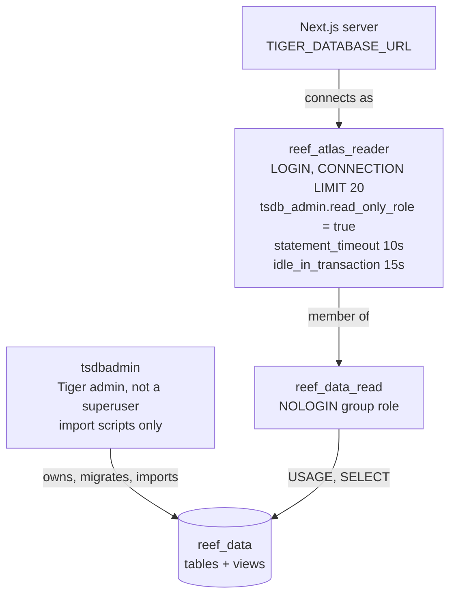

The runtime role follows Tiger's read-only role pattern. `tsdb_admin.read_only_role`
is Tiger Cloud's immutable read-only mode, the setting `tiger db create role
--read-only` applies. A session cannot turn it off. Tested on the live
service: `INSERT`, `DELETE`, temporary tables, `CREATE TABLE`,
`BEGIN READ WRITE` and `SET default_transaction_read_only = off` are all
rejected. The reader's password is generated locally, and only its SCRAM-SHA-256
verifier is sent to the server, because the service logs DDL (`log_statement = ddl`).

#### 6.3 Import pipeline

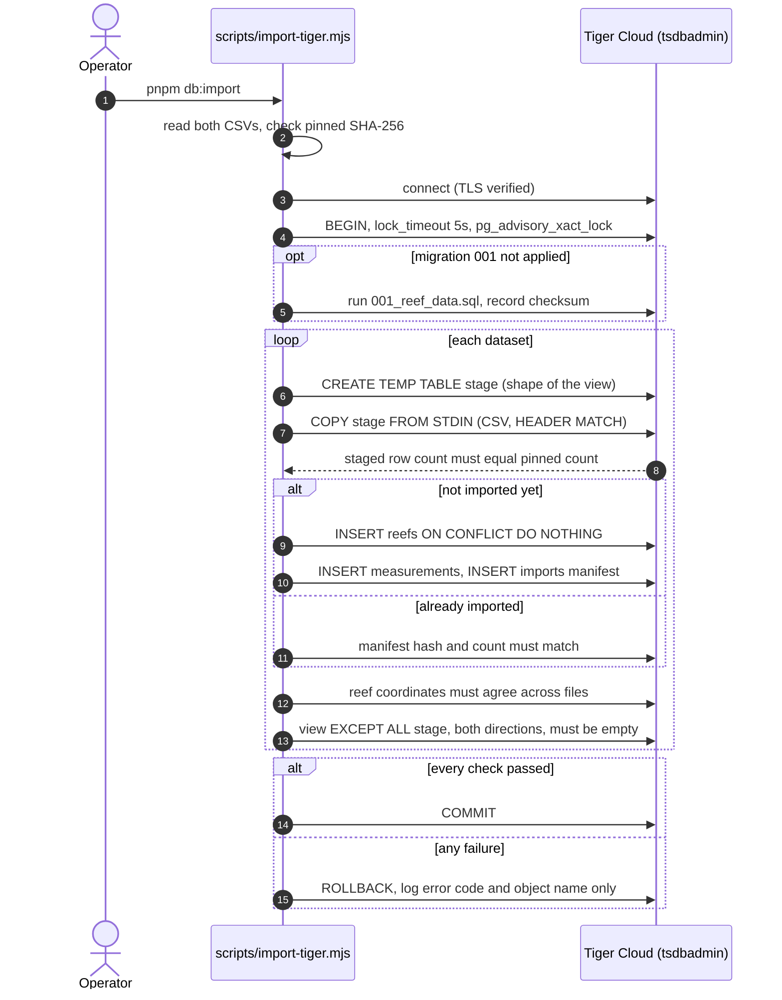

After the staged comparison, every run (including reruns and `pnpm db:verify`)
rebuilds each CSV from its view in pandas' format and compares the SHA-256 with
the pinned hash of the reviewed file, so verification no longer needs the files.
Reruns are idempotent: they verify and add nothing. The whole import is one
transaction, so a partial load is impossible.

The atlas data follows the same rules through `scripts/import-atlas.mjs`
(`pnpm db:atlas`): it replaces the Florida bundle and the documents in one
transaction, reads each dataset back through `database/atlas.mjs` (the code the
API serves it with), requires the read-back to equal the input exactly, and
records its SHA-256 in `atlas_imports`.

#### 6.4 Request path

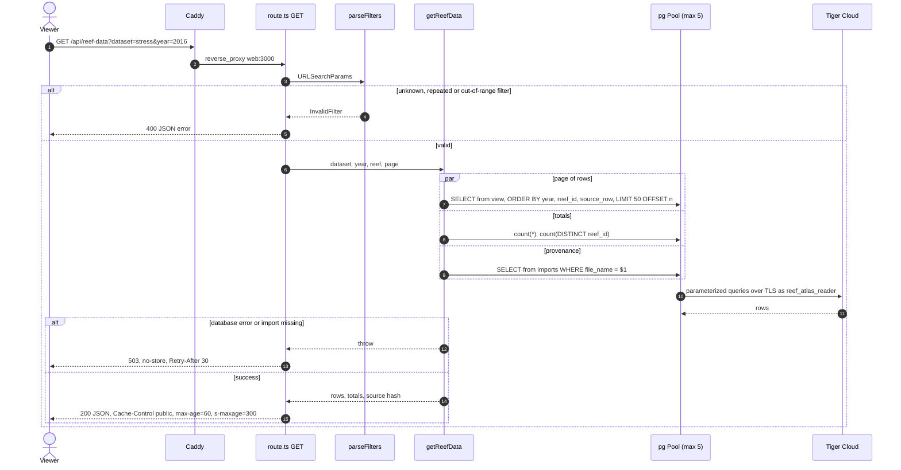

The `/data` page is a server component that calls the same `parseFilters` and
`getReefData`, and renders an HTML table with paging links. Only values reach
SQL as parameters. Table, view and column names come from the fixed allowlist
in `database/datasets.mjs`.

#### 6.5 Server modules

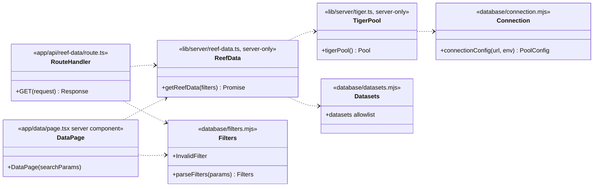

- **One pool per Node process.** It is cached on `globalThis` and has an idle
  `error` handler. Timeouts: connect 10 s, idle 30 s, statement 10 s, query 15 s.
- **TLS.** `connectionConfig` strips every `ssl*` URL parameter and always sets
  `rejectUnauthorized: true`. node-postgres documents that URL SSL parameters
  replace the `ssl` object, so a pasted `sslmode=require` could otherwise weaken
  it. The certificate chains to GTS Root R1, which Node trusts by default.
- **Bundling.** Next.js 16 externalises `pg` by default (`serverExternalPackages`).
  The `server-only` import makes a client import a build error.

#### 6.6 API reference

`GET /api/reef-data`

| Parameter | Values | Default |
| --- | --- | --- |
| `dataset` | `risk` (2021–2025), `stress` (2013–2020), `history` (1985–2025), `forecast` (2027–2031) or `validation` | `risk` |
| `year` | integer within the dataset's period (not accepted for `validation`) | all years |
| `reef` | positive integer reef ID (not accepted for `validation`) | all reefs |
| `page` | 1 to the dataset's last page, 50 rows per page | 1 |

Response: `{ dataset, year, reef, page, pageSize, total, reefs, label, years, hasReefs, columns, rows[], source: { file_name, sha256, row_count, imported_at } }`.
Rows are JSON numbers, booleans, `null` for missing values, and ISO
`YYYY-MM-DD` strings for dates.

App data routes (all read Tiger; 503 with `Retry-After: 30` and no details when it is unreachable):

| Route | Returns |
| --- | --- |
| `GET /api/atlas/florida` | the Florida bundle: `sites`, `thermal`, `storms`, `lionfish`, `simulated`, `meta` |
| `GET /api/atlas/documents/{group}/{name}` | one flagship document as stored, e.g. `flagship/moorea`, `moorea/lagoon`, `soneva/splats`; 404 for any other id |
| `GET /api/atlas/world` | every reef (id, coordinates, latest survey year, survey count) and the years each heat dataset covers |
| `GET /api/atlas/heat?year=YYYY` | peak DHW for every reef in one year (1985–2031) with the year's summary; forecast years add p10/p90, P(DHW ≥ 8) and back-tested skill beside the ten-year baseline; 404 for 2003 and 2026, which the data does not cover |

### 7. Deployment

#### 7.1 Runtime topology

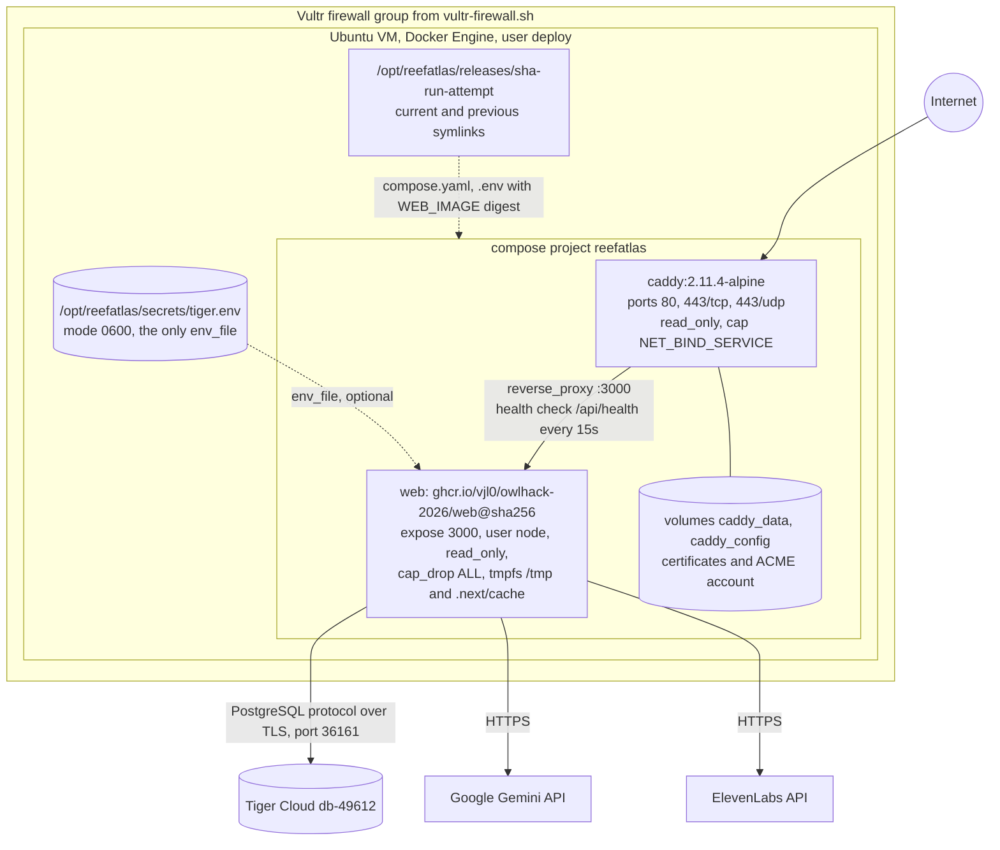

- **Web image.** Multi-stage: dependencies (frozen pnpm lockfile) → build
  (`next build`, standalone output) → runtime. The runtime stage copies only
  `.next/standalone`, `.next/static` and `public`, and runs as `node`.
- **Caddy.** Obtains and renews certificates automatically, serves HTTP/3,
  compresses with zstd/gzip, and sets HSTS, CSP, `nosniff`, referrer and
  permissions policies. It caches `/cesium/*` for a week and redirects `www`
  to the apex domain. The Permissions-Policy disables camera, geolocation,
  payment and USB, but not the microphone the voice panel needs.
- **Secret file is optional for the container, not for the content.** If
  `tiger.env` is missing the server still boots and the page shell loads, but
  every data route returns 503 and the experience shows "Reef data is temporarily
  unavailable" with a retry button. A database outage never fails the container
  health check, so it cannot cause a restart loop. The `speech` container loads the
  same file for the agent's data tools.
- **Voice keys in production.** Compose reads
  `/opt/reefatlas/secrets/voice.env` for Gemini and ElevenLabs
  credentials and `ELEVENLABS_SPEECH_ENGINE_ID`. The speech service requires this
  file. See [setup steps](infra/README.md#speech-engine-gemini-remains-the-agent)
  before deploying. Tiger credentials remain in the existing separate env file.

#### 7.2 Continuous delivery

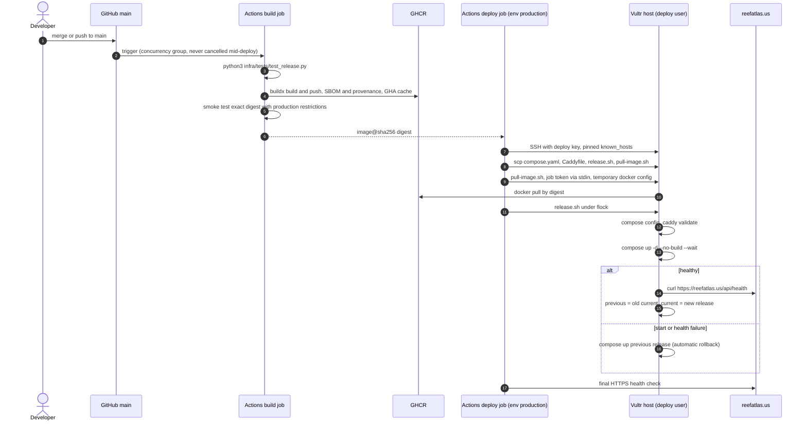

The server never builds code. It runs one immutable image digest per release
directory, so a rollback is `compose up` of the previous directory. No
long-lived registry credential is stored: the job token is used for one pull
and its Docker config is deleted. Details: [`infra/README.md`](infra/README.md).

### 8. Local development

Requirements: Node 24, pnpm 11 (`packageManager` is pinned).

```bash
cd apps/web
pnpm install --frozen-lockfile
pnpm dev                  # http://localhost:3000 (copies Cesium first)
```

Deep links: `http://localhost:3000/#reef=looe-key` (underwater),
`#flagship=moorea` (dossier), `#splat=ootsl1` (Soneva 3D survey). Keys: `Space`
play/pause, `←/→` a week (`Shift` a month, `PgUp/PgDn` a year), `P` pressures,
`V` talk to the reef, `Esc` close the voice panel or stop speech first, then go
back.

| Script | Purpose |
| --- | --- |
| `pnpm build` / `pnpm start` | production build and server |
| `pnpm speech:dev` | run the voice agent service next to `pnpm dev` (ElevenLabs needs a public WebSocket URL for it, see [Speech Engine setup](infra/README.md#speech-engine-gemini-remains-the-agent)) |
| `pnpm typecheck` / `pnpm lint` | TypeScript and ESLint |
| `pnpm data` | rebuild the Florida bundle from `data/raw` into `data/build/atlas` |
| `pnpm data:fetch` | download the flagship sources into `data/raw` (large files reduced on the fly, big downloads cached in ignored `data/cache`) |
| `pnpm data:splats` | convert the Soneva splat PLYs to SPZ and measure change against the noise floor |
| `pnpm data:flagships` | rebuild the flagship dossiers into `data/build/atlas/flagships` |
| `pnpm test:db` | unit tests for connection policy, filters and the CSV float format |
| `pnpm db:validate` | check any supplied CSVs present against their pinned hashes (no database access) |
| `pnpm db:import` | apply migrations and import the supplied CSVs into Tiger (needs the files only for a first import) |
| `pnpm db:atlas` | load `data/build/atlas` (or `-- --from <dir>`) into Tiger and verify the read-back |
| `pnpm db:verify` | read-only: rebuild every CSV and atlas dataset from Tiger and compare SHA-256 |
| `pnpm db:export <dir>` | write the five supplied CSVs back out of Tiger, byte for byte |
| `pnpm db:reader` | create `reef_atlas_reader` once and write its env file |

| Variable | Used by | Notes |
| --- | --- | --- |
| `TIGER_DATABASE_URL` | app runtime | reader role URL, in ignored `.env.local` or the server secret file |
| `TIGER_ADMIN_URL` | import and provisioning scripts | `tsdbadmin`, in ignored `.env.tiger-admin` only |
| `GEMINI_API_KEY` | voice routes | required for streamed agent replies, ask and translate |
| `ELEVENLABS_API_KEY` | Speech Engine service | server-side token creation and WebSocket authentication |
| `ELEVENLABS_SPEECH_ENGINE_ID` | Speech Engine service | `seng_…` returned by `pnpm speech:setup` |
| `SPEECH_PUBLIC_WS_URL` | `speech:setup` | public `wss://…/voice-engine` endpoint |

Without `TIGER_DATABASE_URL` the page shell loads but the experience, `/data` and
the voice agent's data tools report that reef data is temporarily unavailable:
there is no local copy to fall back on. Without the Gemini and ElevenLabs keys,
everything except the voice panel and spoken guide works. Test the production stack locally with
`docker compose -f infra/compose.yaml -f infra/compose.local.yaml up --build`
(serves <http://localhost:8080>).

### 9. Testing and verification

| Check | Command | Covers |
| --- | --- | --- |
| Release recovery | `python3 infra/tests/test_release.py` | promotion, rollback, and first-release paths of `release.sh` |
| Database policy | `pnpm test:db` | TLS cannot be weakened by URL, pool bounds, filter injection, range rejection, Python float formatting |
| Source integrity | `pnpm db:validate` | pinned SHA-256 of any supplied CSV present locally |
| Database contents | `pnpm db:verify` | the five CSVs and 13 atlas datasets rebuilt from Tiger, SHA-256 compared with the pinned and recorded hashes |
| Voice agent | `pnpm test:voice` | tool loop, streaming, abort and retry; reads Tiger through `.env.local` |
| Types and lint | `pnpm typecheck`, `pnpm lint` | whole app |
| Image | CI smoke test | exact published digest under production container restrictions |

At import (2026-09-26), a separate JavaScript parse of the first two CSVs matched
all 203,909 fields read back from Tiger Cloud. `pnpm test:voice` covers streamed
Gemini replies, tool calls and signatures, typed fallback, retry boundaries, and
Speech Engine interruption/event IDs. Live microphone/playback verification
requires the configured engine and public WebSocket endpoint.
