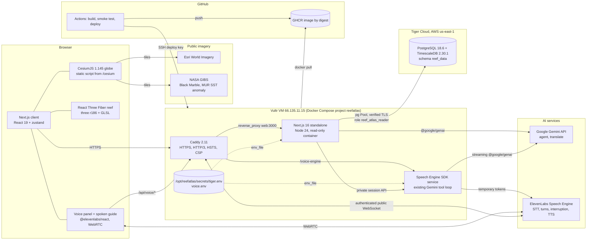
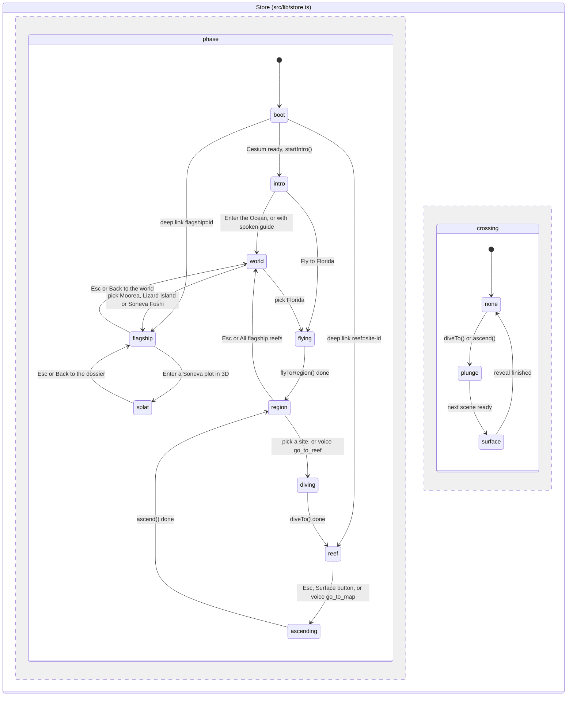
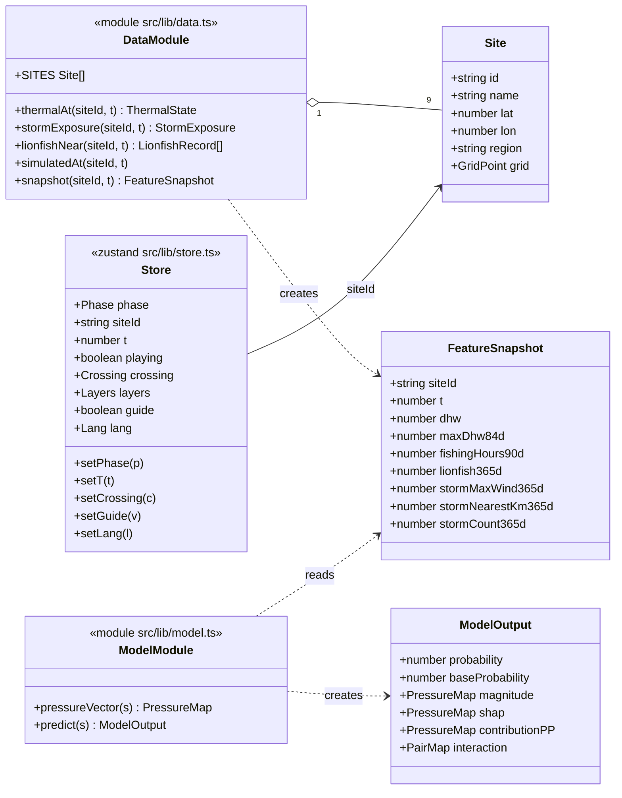
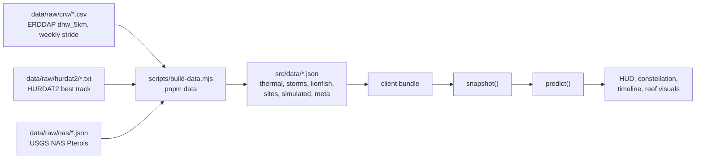
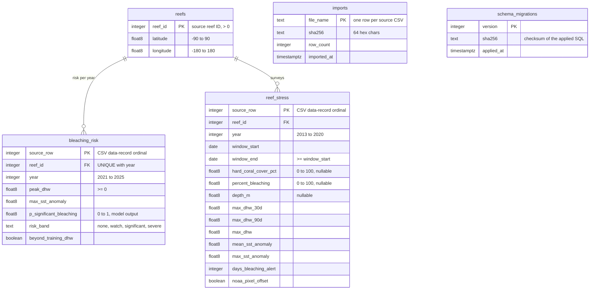
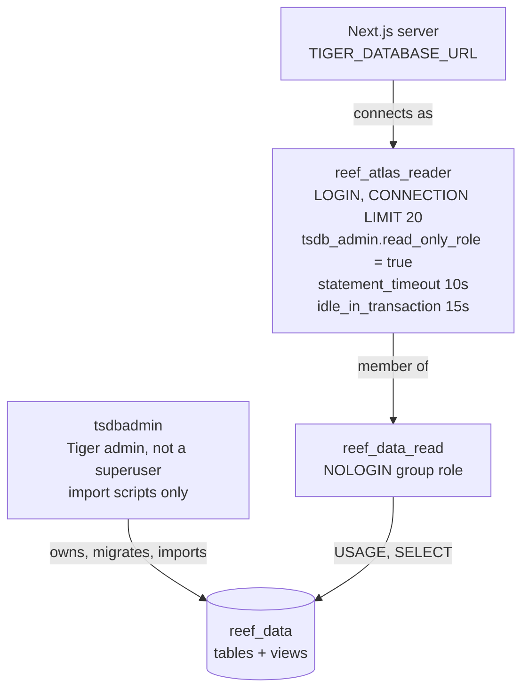
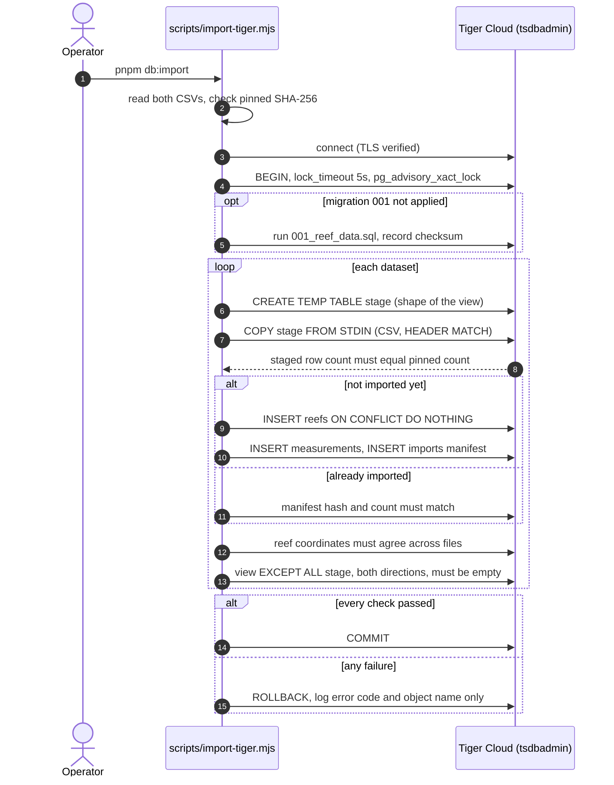
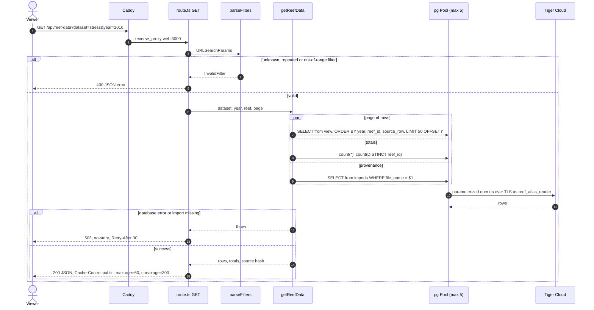
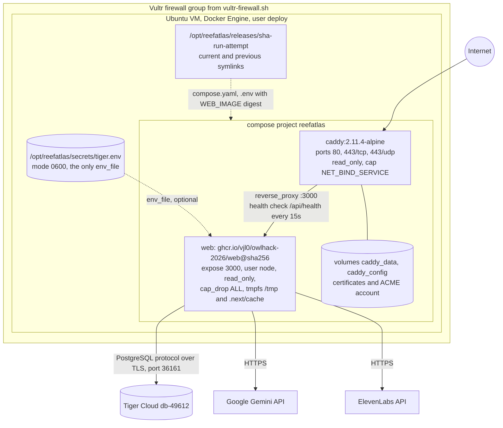
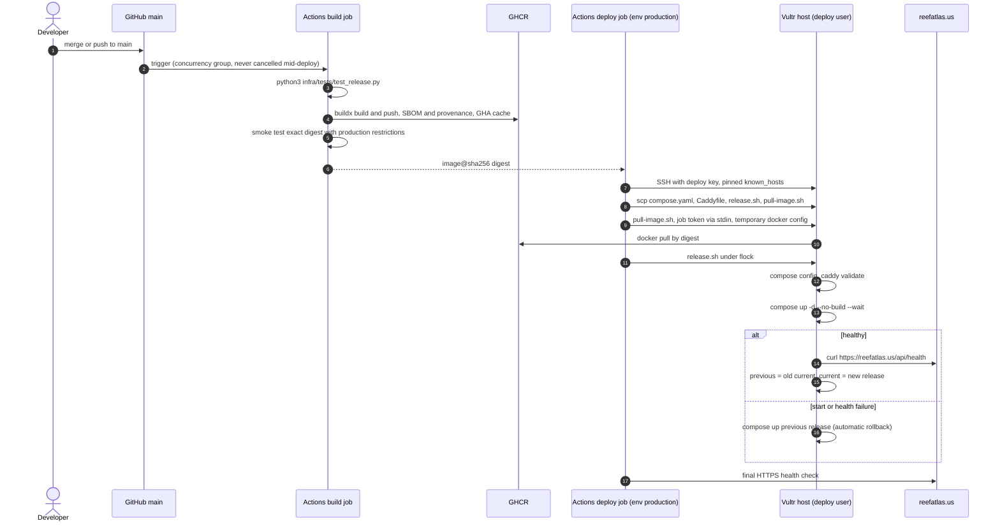

# Reef Atlas

Reefs change between the few times anyone surveys them, while heat, starfish,
storms and fishing overlap in between. Reef Atlas reconstructs what happened
between surveys at four places with long public records: Moorea (French
Polynesia), Lizard Island (Great Barrier Reef), Soneva Fushi (Maldives, real 3D
photogrammetry) and Florida's Coral Reef. It has a voice guide you can talk to,
and a public archive of global reef bleaching data served from Tiger Cloud
(TigerData). Built for OwlHacks 2026.

- Live experience: <https://reefatlas.us>
- Reef data explorer: <https://reefatlas.us/data>
- Data API: <https://reefatlas.us/api/reef-data?dataset=risk&year=2023>

The viewer starts on the night side of the Earth and pulls back to the whole
globe, where 2,720 reefs are coloured by their heat stress and four flagship
reefs are marked. Each flagship opens an evidence dossier: an evidence timeline
of field surveys, reef sensors, satellite heat stress, cyclone tracks and the
monitoring program's own attributions, with every stretch nobody observed shown
as such; the declines measured between consecutive surveys, each with what else
was present in that interval (never a claimed cause); what is missing; and why
the reef needs another look. At Soneva Fushi you can enter the real 3D surveys
of a reef plot and switch between dates. Florida keeps its cinematic flight down
the reef tract and a dive beneath one of nine reef sites, where heat stress,
fishing activity, invasive lionfish and hurricanes drive the underwater scene. Press `V` to ask the reef a question by voice or text,
in English or Spanish. A Gemini agent answers only from the reef data, and can
move the page ("take me to Moorea", "take me to Looe Key", "go to August 2023"). ElevenLabs speaks
the answer. A separate server-rendered explorer pages through 18,539 records for
2,720 reefs worldwide, stored in PostgreSQL on Tiger Cloud.

## Contents

1. [What is real and what is simulated](#1-what-is-real-and-what-is-simulated)
2. [System architecture](#2-system-architecture)
3. [Repository layout](#3-repository-layout)
4. [Frontend](#4-frontend)
5. [Voice agent](#5-voice-agent)
6. [TigerData layer](#6-tigerdata-layer)
7. [Deployment](#7-deployment)
8. [Local development](#8-local-development)
9. [Testing and verification](#9-testing-and-verification)
10. [Official documentation](#10-official-documentation)

Deeper references: [`apps/web/README.md`](apps/web/README.md) (the experience),
[`apps/web/database/README.md`](apps/web/database/README.md) (TigerData),
[`infra/README.md`](infra/README.md) (operations).

## 1. What is real and what is simulated

Every number on screen carries a provenance glyph: ● observed, ◌ model output,
⊘ simulated.

Flagship reefs use a finer set of evidence labels: field survey, reef sensor,
satellite, storm track, reported cause, derived. The full verified inventory
(URLs, variables, dates, resolution, licences, limitations, and what could not be
accessed) is in [`docs/data-inventory.md`](docs/data-inventory.md).

| Layer | Source | Kind | Where it lives |
| --- | --- | --- | --- |
| Moorea coral, macroalgae, fish, crown-of-thorns starfish (2005–2025), reef thermistors (2005–2024), 49-sensor lagoon network (2021–2025), 2019 bleaching colony segmentation | Moorea Coral Reef LTER data packages on EDI (knb-lter-mcr.4, .6, .1039, .1035, .1045, .5050) | field / sensor | `data/raw/mcr`, `src/data/flagships/moorea*.json` |
| Lizard Island coral cover, starfish, juvenile corals (1985–2026) and disturbance attributions | AIMS Long-Term Monitoring Program (doi:10.25845/5c09bc4ff315c) | field / reported | `data/raw/aims`, `src/data/flagships/lizard-island.json` |
| Soneva Fushi 3D surveys: 23 surveys, 6 plots, Gaussian splats | wildflow/soneva-corals (Hugging Face, CC BY 4.0), 2 plots converted to SPZ | field (3D) | `public/splats/soneva`, `src/data/flagships/soneva-*.json` |
| Heat stress at the flagships (weekly, 2002–2026) | NOAA Coral Reef Watch 5 km v3.1 via NOAA CoastWatch ERDDAP | satellite | `data/raw/crw/weekly-*.csv` |
| On-reef heat stress at Moorea | NOAA's DHW method applied to the 10 m thermistor | derived | `src/data/flagships/moorea.json` |
| Cyclones near the flagships (1985–2026) | NOAA NCEI IBTrACS v04r01 | track | `data/raw/ibtracs` |
| Surface change vs. noise floor, Soneva plots | height comparison of co-registered splats | derived | `src/data/flagships/soneva-change.json` |
| Degree Heating Weeks, SST, SST anomaly, alert level (9 sites, weekly, 2016–2024) | NOAA Coral Reef Watch 5 km v3.1 via PacIOOS ERDDAP | observed | `src/data/thermal.json` |
| Hurricane tracks and closest approach per site | NOAA NHC HURDAT2 (2025 release) | observed / derived | `src/data/storms.json` |
| Lionfish records within 25 km | USGS Nonindigenous Aquatic Species | observed | `src/data/lionfish.json` |
| Sea-temperature anomaly map (from 2019-07-23) | NASA JPL MUR via NASA GIBS | observed | fetched live as map tiles |
| Bleaching risk 2021–2025, 2,720 reefs | `bleaching_risk_2021_2025.csv` (supplied model output) | model | Tiger Cloud `reef_data` |
| Reef surveys with 365-day heat-stress windows, 2013–2020 | `reef_stress_analysis.csv` (supplied) | observed / derived, as supplied | Tiger Cloud `reef_data` |
| AIS fishing, vessel presence, SAR detections | Seeded simulation shaped by real seasons | simulated | `src/data/simulated.json` |
| Bleaching probability and its explanation in the 3D scene | Demo logistic model with hand-set weights and exact Shapley values | model (demo) | `src/lib/model.ts` |
| Voice agent answers | Gemini, restricted to tool results over the bundled JSON above (`REEF_DATA=json`) | same as the data it cites | `src/server/agent` |

The Tiger datasets include 740 reefs in the Florida Keys, but they use their own
reef IDs and are **not** joined to the nine demonstration sites. The voice agent
does not read Tiger yet: `REEF_DATA=tiger` is declared but not implemented.

## 2. System architecture



The browser uses our origin for app data and ElevenLabs for WebRTC audio. Caddy terminates TLS, adds the security
headers, compresses responses, and proxies to the Next.js server. Most of the
experience is static: the observed Florida datasets are baked into JSON at build
time and ship with the client bundle, so the 3D experience needs only the map
tiles from the network.

Three kinds of request reach the server:

- `/data` and `/api/reef-data` query Tiger as a read-only database role.
- `/api/voice/*` calls Gemini and ElevenLabs with API keys held only on the
  server.
- `/api/health` is the liveness probe.

API keys stay on the server. The browser receives a temporary conversation token
and a per-session capability for page context and actions. CSP permits the
ElevenLabs API and WebRTC hosts.

## 3. Repository layout

```text
apps/web/                      Next.js 16 app (the only deployable)
  src/app/
    page.tsx                   the 3D experience (client component tree)
    data/page.tsx              /data explorer (server component, reads Tiger)
    api/reef-data/route.ts     GET /api/reef-data (route handler, reads Tiger)
    api/voice/                 ask, session, translate (Gemini, Speech Engine)
    api/health/route.ts        liveness probe for Docker and Caddy
    globals.css, interface.css base rules, then the glass interface layer
  src/features/                experience, globe, dive, reef, hud, timeline, intro
  src/features/atlas/          world view, flagship dossier, evidence timeline, side cards
  src/features/splat/          Soneva 3D surveys (Spark Gaussian splats in React Three Fiber)
  src/features/voice/          VoiceAgent + React SDK, Narrator, narration bridge, i18n
  src/lib/                     data access, time, demo model, store, narrative,
                               navigation (page moves), voiceActions (UiAction types)
  src/lib/server/              server-only: pg pool and dataset queries
  src/server/                  server-side (imported only by route handlers): Gemini
                               client, agent loop and tools, ReefData interface and
                               its JSON implementation
  src/data/                    generated JSON (committed; built from data/raw)
  src/data/flagships/          flagship dossiers, Moorea lagoon and 2019 plots, Soneva splat manifest
  database/                    SQL migration, dataset allowlist, filters, tests, docs
  scripts/                     copy-cesium, build-data, import-tiger, provision-tiger-reader,
                               fetch-flagships, prepare-splats, analyze-soneva, build-flagships
  public/splats/soneva/        SPZ files for two Soneva plots, four dates each
  Dockerfile                   multi-stage standalone image, non-root runtime
data/raw/                      raw NOAA CRW CSVs, HURDAT2, USGS lionfish JSON; flagship sources
                               (mcr, aims, soneva, ibtracs, crw weekly) with SHA-256 in sources.json
docs/data-inventory.md         verified inventory of every flagship data source
bleaching_risk_2021_2025.csv   source dataset (never edited; hash pinned)
reef_stress_analysis.csv       source dataset (never edited; hash pinned)
infra/                         compose.yaml, Caddyfile, release scripts, tests
.github/workflows/deploy.yml   build, smoke test and deploy on push to main
```

## 4. Frontend

### 4.1 Experience state machine

The whole experience is one zustand store (`src/lib/store.ts`). A `phase` field
drives which scene is mounted and what the camera does. A second field,
`crossing`, drives the water transition between the globe and the reef.



The two regions run concurrently. `crossing` starts during `diving` or `reef`
and finishes after the phase has changed. What each transition does in the code:

- **boot → intro.** `globeController.startIntro()` runs once Cesium has loaded.
  The reef tract draws itself as a filament of light and the city lights fade in.
- **region.** Globe input is enabled. `ReefView` is preloaded with a dynamic
  `import()` so the dive does not wait on the download.
- **diving → reef.** Cesium flies to the site and waits for high-zoom tiles
  (at most 1.3 s). It sets `crossing = plunge` and then `phase = reef`.
- **reef.** `ReefView` mounts. After 1.2 s the globe sets
  `viewer.useDefaultRenderLoop = false` and hides its canvas, so the GPU renders
  only the reef.
- **plunge → surface.** `DiveOverlay` is a pure CSS animation on the compositor
  thread. It keeps moving while the reef compiles its shaders. It reveals the
  next scene once it is ready: the reef after `ReadySignal` has counted three
  rendered frames, or the globe when the phase is `ascending` or `region`.
- **ascending → region.** The reverse: cover with water, restore the globe's
  render loop, fly back up.
- **Voice moves.** The voice agent's page actions use the same store calls as a
  click. `go_to_reef` from inside another reef first ascends, waits for
  `phase = region`, and then dives (`goToReef` in `src/lib/navigation.ts`).
- **Reduced motion.** It follows the OS `prefers-reduced-motion` setting (there
  is no in-app switch). When on, camera flights become instant cuts. The
  `motion` library gets `MotionConfig reducedMotion="always"`, so interface
  transitions keep their opacity fades but drop movement.

### 4.2 Rendering stack

| Concern | Implementation |
| --- | --- |
| Globe | CesiumJS loaded as a static script (`/cesium/Cesium.js`, copied by `scripts/copy-cesium.mjs` before `dev` and `build`). This keeps Cesium's workers and assets out of the bundler. `GlobeView` is `next/dynamic` with `ssr: false`. |
| Imagery | Natural Earth II (bundled with Cesium), Esri World Imagery by day, NASA Black Marble by night, and the NASA MUR SST anomaly for the timeline date (only dates the GIBS capabilities list, from 2019-07-23). |
| Reef scene | React Three Fiber 9 with drei and postprocessing. Spur-and-groove terrain from deterministic value noise, instanced procedural coral taxa, fish schools, caustics, Snell's window, and silhouettes of surface traffic. |
| Shared uniforms | `features/reef/env.ts` keeps one set of uniform objects used by every reef material. `EnvDriver` recomputes the data-driven target (DHW, storm, SST) when the site or date changes, and eases toward it every frame. |
| Labels | 3D components publish world-space anchors. A plain DOM layer (`LabelLayer`) projects them with the live camera each frame, so text stays crisp and accessible. |
| Time | A float of days since 2016-01-01 UTC (`src/lib/time.ts`), clamped to 2016-01-01 … 2024-12-31. The default is 2023-08-20, the peak of the 2023 Florida marine heatwave. |
| Interface | Geist and Geist Mono (`next/font`). Frosted-glass panels live in `interface.css`, which is loaded after `globals.css`. Panel motion uses one critically damped spring (`src/lib/ui.ts`) and full `transform` strings, so animations stay on the compositor while the reef scene loads. |

### 4.3 Client domain model



`PressureMap` is `Record<Pressure, number>` over heat, fishing, lionfish and
storm. `PairMap` covers the three interaction pairs. `Crossing` is
`none | plunge | surface`. `Lang` is `en | es`. `guide` switches the spoken
narration on.

`snapshot(siteId, t)` combines every pressure at one moment: it interpolates
the weekly CRW samples, takes the maximum DHW over the previous 84 days,
aggregates the simulated AIS series, counts lionfish records within 25 km in the
previous 365 days, and finds the strongest storm within 150 km. It mirrors one
row of the planned `reef_feature_snapshots` table, so a real backend can replace
it without touching the UI.

### 4.4 Offline data pipeline



`build-data.mjs` computes haversine distances from each site to every
hurricane fix and lionfish record. It seeds the simulated AIS series so the demo
is deterministic, and writes `meta.json` with the provenance of each source.

### 4.5 Demo bleaching model

`src/lib/model.ts` is a stand-in for the planned XGBoost + TreeSHAP service. It
returns the same shape the real API will: probability, base value, one Shapley
value per pressure, and pairwise interactions. It is a logistic model with
hand-set (untrained) weights and three interaction pairs,
$P = \lbrace (h,f), (h,s), (f,l) \rbrace$ for heat, fishing, lionfish and storm:

```math
z(x) = b + \sum_{k} w_k x_k + \sum_{(a,c) \in P} w_{ac}\, x_a x_c ,
\qquad p = \sigma(z) = \frac{1}{1 + e^{-z}}
```

The inputs $x_k$ are normalised pressure magnitudes, for example
$x_{heat} = \mathrm{clamp}(\mathrm{maxDHW}_{84d}/12,\ 0,\ 1.6)$. The baseline
$\bar{x}$ is the mean vector over every site and month. Shapley values are exact
for this model: each linear term is attributed to its own feature, and each
product term is split evenly between its two features:

```math
\phi_k = w_k (x_k - \bar{x}_k) + \sum_{(k,c) \in P} \tfrac{1}{2}\, w_{kc} (x_k - \bar{x}_k)(x_c + \bar{x}_c),
\qquad \sum_k \phi_k = z(x) - z(\bar{x})
```

The pure interaction shown on the constellation's outer arcs is
$I_{ac} = w_{ac}(x_a - \bar{x}_a)(x_c - \bar{x}_c)$. Shapley values are
converted from log-odds to percentage points in proportion to their share of the
change: $c_k = 100\,(p - p_0)\,\phi_k / (z - z_0)$.

## 5. Voice agent

Ask the reef by voice or text (`V` to start/end voice, `Esc` to close), in
English or Spanish. The existing Gemini agent and all data/page tools remain.

Browser `@elevenlabs/react` → ElevenLabs Speech Engine → Vultr's authenticated
WebSocket endpoint → Gemini and existing tools → streamed text back through
Speech Engine. ElevenLabs owns STT, turn-taking, interruption, TTS and playback.
There is no browser WAV recorder, Gemini transcription, or `/api/voice/speak`.

`VoiceAgent` uses `ConversationProvider` and a temporary WebRTC conversation
token. The server-side TypeScript SDK attaches to `/ws` in the `speech` service;
Caddy exposes it at `/voice-engine`. The browser sends current reef, timeline,
layers and language through `/api/voice/session`, and polls that session for
validated UI actions and tool traces. Actions still call `runAction`.

`streamAgent` retains the existing prompt and six-turn tool loop. It streams
Gemini text immediately, preserves function responses and thought signatures,
and passes Speech Engine's abort signal to Gemini. Aborted turns cannot publish
pending page actions. Transient retries happen only before the first chunk, so
partial speech is never replayed by a retry.

Typed questions use `/api/voice/ask` when disconnected, including when microphone
permission or Speech Engine is unavailable. In an active conversation they use
`sendUserMessage`. The optional scene guide and replay use the same Speech Engine
session; the guide starts muted and may request microphone permission. Narrator
still maintains its screen-reader live region and Spanish caption translations.

Setup, public WebSocket routing, secrets and live verification steps are in
[Speech Engine deployment](infra/README.md#speech-engine-gemini-remains-the-agent).

### 5.1 Tools

| Tool | Kind | Source | Returns |
| --- | --- | --- | --- |
| `get_thermal_summary(site_id, from, to)` | data | NOAA CRW, observed | peak DHW and date, weeks with DHW ≥ 4 and ≥ 8, highest alert level, mean SST, max anomaly, latest values |
| `get_storms_near(site_id, from, to, max_km = 150)` | data | HURDAT2, observed | storms whose closest approach falls in range, nearest first |
| `get_lionfish_near(site_id, from, to, radius_km = 25)` | data | USGS NAS, observed | count, first and latest date, nearest distance, count per year |
| `get_activity(site_id, from, to)` | data | **simulated** AIS / SAR | fishing hours, vessel hours, SAR detections, unmatched SAR |
| `compare_sites(metric, from, to)` | data | any of the above | all nine sites ranked by `max_dhw`, `weeks_dhw_at_least_4`, `lionfish_sightings`, `storm_passes` or `fishing_hours` |
| `get_flagship_evidence(flagship_id, from_year?, to_year?)` | data | flagship dossiers (field, sensor, satellite, track, reported, derived) | survey values with dates, heat peaks, cyclones, reported causes, declines with what co-occurred, gaps, what is missing |
| `go_to_flagship(flagship_id)` / `go_to_world()` | page | – | open Moorea, Lizard Island, Soneva Fushi or Florida; pull back to the globe |
| `set_flagship_date(date)` | page | – | move the dossier's evidence timeline cursor |
| `go_to_reef(site_id)` | page | – | dive to one of the nine sites |
| `go_to_map()` | page | – | rise back to the map |
| `set_date(date)` | page | – | move the timeline (2016-01-01…2024-12-31) |
| `set_layer(layer, on)` | page | – | `sst`, `storms` or `lionfish` |
| `set_playing(playing)` | page | – | play or pause time |

### 5.2 Voice API

| Route | Purpose |
| --- | --- |
| `POST /api/voice/session` | Mint temporary conversation token and browser session capability |
| `GET /api/voice/session?after=` | Read new action/trace events using the session capability |
| `PATCH /api/voice/session` | Update page context or request scripted scene narration |
| `DELETE /api/voice/session` | End and release the session |
| `POST /api/voice/ask` | Typed fallback: `{ question, ...context }` → `{ answer, trace, actions }` |
| `POST /api/voice/translate` | Translate the existing scripted guide captions |

API keys are server-only. Session updates require the random capability returned
at creation, and upstream WebSockets require ElevenLabs' signed JWT. Public token
creation and typed questions retain the app's existing lack of user authentication
and rate limiting. Model overrides remain `GEMINI_MODEL` and `GEMINI_FALLBACK_MODEL`.

## 6. TigerData layer

Tiger Cloud service `db-49612` (PostgreSQL 18.6, TimescaleDB 2.30.1, AWS
us-east-1) stores the two supplied CSVs in schema `reef_data`. Full rationale,
role setup, and runbook: [`apps/web/database/README.md`](apps/web/database/README.md).

### 6.1 Schema



| Table | Rows | Notes |
| --- | ---: | --- |
| `reefs` | 2,720 | Both files repeat identical coordinates per reef, so they are stored once (3NF). |
| `bleaching_risk` | 13,245 | One row per reef and year. Indexed on `(reef_id, year)` (unique) and `(year, reef_id, source_row)`. |
| `reef_stress` | 5,294 | 528 reef/year keys repeat (several surveys), so `source_row` is the key. Indexed both ways for filters and paging. |
| `imports`, `schema_migrations` | 2, 1 | SHA-256 and row count of each imported file, and the checksum of the applied migration. Reruns check these instead of reloading. |

Two views, `bleaching_risk_records` and `reef_stress_records`, join the
coordinates back and return exactly the CSV columns in CSV order. The app reads
the views, and verification compares them with the source files.

**Why ordinary tables and not hypertables.** Tiger's hypertable guidance targets
insert-heavy time series ("Large volumes (1M+ rows), time-based queries,
infrequent updates"). Columnstore needs more than 100 rows per `segmentby` value
per chunk. These are about 18.5k static annual rows with one row per reef per
year, so chunking would add overhead without benefit. Types follow Tiger's
`design-postgres-tables` guidance: `double precision` for measured floats,
`date` for survey windows, `boolean NOT NULL` for flags, `text` + `CHECK` for
the risk band.

### 6.2 Access control



The runtime role follows Tiger's read-only role pattern. `tsdb_admin.read_only_role`
is Tiger Cloud's immutable read-only mode, the setting `tiger db create role
--read-only` applies. A session cannot turn it off. Tested on the live
service: `INSERT`, `DELETE`, temporary tables, `CREATE TABLE`,
`BEGIN READ WRITE` and `SET default_transaction_read_only = off` are all
rejected. The reader's password is generated locally, and only its SCRAM-SHA-256
verifier is sent to the server, because the service logs DDL (`log_statement = ddl`).

### 6.3 Import pipeline



Reruns are idempotent: they verify and add nothing. `pnpm db:verify` runs the
same comparison without writing. The whole import is one transaction, so a
partial load is impossible.

### 6.4 Request path



The `/data` page is a server component that calls the same `parseFilters` and
`getReefData`, and renders an HTML table with paging links. Only values reach
SQL as parameters. Table, view and column names come from the fixed allowlist
in `database/datasets.mjs`.

### 6.5 Server modules


- **One pool per Node process.** It is cached on `globalThis` and has an idle
  `error` handler. Timeouts: connect 10 s, idle 30 s, statement 10 s, query 15 s.
- **TLS.** `connectionConfig` strips every `ssl*` URL parameter and always sets
  `rejectUnauthorized: true`. node-postgres documents that URL SSL parameters
  replace the `ssl` object, so a pasted `sslmode=require` could otherwise weaken
  it. The certificate chains to GTS Root R1, which Node trusts by default.
- **Bundling.** Next.js 16 externalises `pg` by default (`serverExternalPackages`).
  The `server-only` import makes a client import a build error.

### 6.6 API reference

`GET /api/reef-data`

| Parameter | Values | Default |
| --- | --- | --- |
| `dataset` | `risk` (2021–2025) or `stress` (2013–2020) | `risk` |
| `year` | integer within the dataset's period | all years |
| `reef` | positive integer reef ID | all reefs |
| `page` | 1–1000, 50 rows per page | 1 |

Response: `{ dataset, year, reef, page, pageSize, total, reefs, columns, rows[], source: { file_name, sha256, row_count, imported_at } }`.
Rows are JSON numbers, booleans, `null` for missing values, and ISO
`YYYY-MM-DD` strings for dates.

## 7. Deployment

### 7.1 Runtime topology



- **Web image.** Multi-stage: dependencies (frozen pnpm lockfile) → build
  (`next build`, standalone output) → runtime. The runtime stage copies only
  `.next/standalone`, `.next/static` and `public`, and runs as `node`.
- **Caddy.** Obtains and renews certificates automatically, serves HTTP/3,
  compresses with zstd/gzip, and sets HSTS, CSP, `nosniff`, referrer and
  permissions policies. It caches `/cesium/*` for a week and redirects `www`
  to the apex domain. The Permissions-Policy disables camera, geolocation,
  payment and USB, but not the microphone the voice panel needs.
- **Secret file is optional.** If `tiger.env` is missing the demo still boots,
  and the dataset routes return 503. A database outage never fails the
  container health check, so it cannot cause a restart loop.
- **Voice keys in production.** Compose reads
  `/opt/reefatlas/secrets/voice.env` (or `VOICE_ENV_FILE`) for Gemini and ElevenLabs
  credentials and `ELEVENLABS_SPEECH_ENGINE_ID`. The speech service requires this
  file. See [setup steps](infra/README.md#speech-engine-gemini-remains-the-agent)
  before deploying. Tiger credentials remain in the existing separate env file.

### 7.2 Continuous delivery



The server never builds code. It runs one immutable image digest per release
directory, so a rollback is `compose up` of the previous directory. No
long-lived registry credential is stored: the job token is used for one pull
and its Docker config is deleted. Details: [`infra/README.md`](infra/README.md).

## 8. Local development

Requirements: Node 24, pnpm 11 (`packageManager` is pinned).

```bash
cd apps/web
pnpm install --frozen-lockfile
pnpm dev                  # http://localhost:3000 (copies Cesium first)
```

Deep links: `http://localhost:3000/#reef=looe-key` (underwater),
`#flagship=moorea` (dossier), `#splat=ootsl1` (Soneva 3D survey). Keys: `Space`
play/pause, `←/→` a week (`Shift` a month, `PgUp/PgDn` a year), `P` pressures,
`V` talk to the reef, `Esc` close the voice panel or stop speech first, then go
back.

| Script | Purpose |
| --- | --- |
| `pnpm build` / `pnpm start` | production build and server |
| `pnpm typecheck` / `pnpm lint` | TypeScript and ESLint |
| `pnpm data` | rebuild the Florida `src/data/*.json` from `data/raw` |
| `pnpm data:fetch` | download the flagship sources into `data/raw` (large files reduced on the fly, big downloads cached in ignored `data/cache`) |
| `pnpm data:splats` | convert the Soneva splat PLYs to SPZ and measure change against the noise floor |
| `pnpm data:flagships` | rebuild `src/data/flagships/*.json` and `src/data/global-reefs.json` |
| `pnpm test:db` | unit tests for connection policy and filters |
| `pnpm db:validate` | check both CSV hashes (no database access) |
| `pnpm db:import` / `pnpm db:verify` | import into Tiger, or verify without writing |
| `pnpm db:reader` | create `reef_atlas_reader` once and write its env file |

| Variable | Used by | Notes |
| --- | --- | --- |
| `TIGER_DATABASE_URL` | app runtime | reader role URL, in ignored `.env.local` or the server secret file |
| `TIGER_POOL_MAX` | app runtime | 1–20, default 5 per process |
| `TIGER_CA_CERT_PATH` | runtime and scripts | optional private CA bundle; not needed for Tiger Cloud |
| `TIGER_ADMIN_URL` | import and provisioning scripts | `tsdbadmin`, in ignored `.env.tiger-admin` only |
| `TIGER_READER_ENV_FILE` | `db:reader` | output path, default `.env.tiger-reader` |
| `TIGER_ENV_FILE` | Compose | overrides `/opt/reefatlas/secrets/tiger.env` |
| `GEMINI_API_KEY` | voice routes | required for streamed agent replies, ask and translate |
| `GEMINI_MODEL` / `GEMINI_FALLBACK_MODEL` | voice routes | default `gemini-flash-latest` / `gemini-flash-lite-latest`; pin stable IDs for production |
| `ELEVENLABS_API_KEY` | Speech Engine service | server-side token creation and WebSocket authentication |
| `ELEVENLABS_SPEECH_ENGINE_ID` | Speech Engine service | `seng_…` returned by `pnpm speech:setup` |
| `ELEVENLABS_VOICE_ID` | `speech:setup` | default `JBFqnCBsd6RMkjVDRZzb` ("George"), with `eleven_flash_v2_5` |
| `SPEECH_PUBLIC_WS_URL` | `speech:setup` | public `wss://…/voice-engine` endpoint |
| `VOICE_ENV_FILE` | Compose | overrides `/opt/reefatlas/secrets/voice.env` |
| `REEF_DATA` | voice agent | `json` (default); `tiger` is not implemented yet |

Without `TIGER_DATABASE_URL` the 3D experience works fully, and `/data` shows a
"temporarily unavailable" message. Without the Gemini and ElevenLabs keys,
everything except the voice panel and spoken guide works. Test the production stack locally with
`docker compose -f infra/compose.yaml -f infra/compose.local.yaml up --build`
(serves <http://localhost:8080>).

## 9. Testing and verification

| Check | Command | Covers |
| --- | --- | --- |
| Release recovery | `python3 infra/tests/test_release.py` | promotion, rollback, and first-release paths of `release.sh` |
| Database policy | `pnpm test:db` | TLS cannot be weakened by URL, pool bounds, filter injection, and range rejection |
| Source integrity | `pnpm db:validate` | pinned SHA-256 of both CSVs |
| Database contents | `pnpm db:verify` | every row compared with the CSVs in both directions (`EXCEPT ALL`) |
| Types and lint | `pnpm typecheck`, `pnpm lint` | whole app |
| Image | CI smoke test | exact published digest under production container restrictions |

At import (2026-09-26), a separate JavaScript parse of both CSVs matched all
203,909 fields read back from Tiger Cloud. `pnpm test:voice` covers streamed
Gemini replies, tool calls and signatures, typed fallback, retry boundaries, and
Speech Engine interruption/event IDs. Live microphone/playback verification
requires the configured engine and public WebSocket endpoint.

## 10. Official documentation

- Tiger Cloud: [read-only roles](https://www.tigerdata.com/docs/deploy/tiger-cloud/tiger-cloud-aws/security/read-only-role), [Tiger CLI `db create role --read-only`](https://www.tigerdata.com/docs/reference/tiger-cloud/tiger-cli), [stricter SSL](https://www.tigerdata.com/docs/deploy/tiger-cloud/tiger-cloud-aws/security/strict-ssl), [connection pooling](https://www.tigerdata.com/docs/deploy/tiger-cloud/tiger-cloud-aws/service-management/connection-pooling), [IP allow list](https://www.tigerdata.com/docs/deploy/tiger-cloud/tiger-cloud-aws/security/ip-allow-list), [high availability](https://www.tigerdata.com/docs/deploy/tiger-cloud/tiger-cloud-aws/high-availability/high-availability), [CSV ingest](https://www.tigerdata.com/docs/deploy/mst/ingest-data#bulk-upload-from-csv-files), [hypertables](https://www.tigerdata.com/docs/learn/hypertables/understand-hypertables), Tiger MCP skills `design-postgres-tables`, `find-hypertable-candidates`, `setup-timescaledb-hypertables`
- PostgreSQL 18: [COPY](https://www.postgresql.org/docs/18/sql-copy.html), [CREATE ROLE](https://www.postgresql.org/docs/18/sql-createrole.html)
- node-postgres: [SSL](https://node-postgres.com/features/ssl), [Pool](https://node-postgres.com/apis/pool), [pool sizing](https://node-postgres.com/guides/pool-sizing); [pg-copy-streams](https://github.com/brianc/node-pg-copy-streams)
- Next.js 16.3.6 bundled docs (`apps/web/node_modules/next/dist/docs/`): data security and `server-only`, `serverExternalPackages`, route segment config, [self-hosting](https://nextjs.org/docs/app/guides/self-hosting)
- Gemini API: [function calling](https://ai.google.dev/gemini-api/docs/function-calling), [audio understanding](https://ai.google.dev/gemini-api/docs/audio), [models and `latest` aliases](https://ai.google.dev/gemini-api/docs/models), [Google Gen AI JavaScript SDK](https://googleapis.github.io/js-genai/)
- ElevenLabs: [stream text to speech](https://elevenlabs.io/docs/api-reference/text-to-speech/stream)
- Browser APIs (MDN): [autoplay guide](https://developer.mozilla.org/en-US/docs/Web/Media/Guides/Autoplay), [MediaRecorder](https://developer.mozilla.org/en-US/docs/Web/API/MediaRecorder), [OfflineAudioContext](https://developer.mozilla.org/en-US/docs/Web/API/OfflineAudioContext)
- Deployment: [GitHub Actions secure use](https://docs.github.com/en/actions/reference/security/secure-use), [GHCR](https://docs.github.com/en/packages/working-with-a-github-packages-registry/working-with-the-container-registry), [Compose up `--wait`](https://docs.docker.com/reference/cli/docker/compose/up/), [Caddy automatic HTTPS](https://caddyserver.com/docs/automatic-https), [Vultr firewall rules](https://docs.vultr.com/products/network/firewall-groups/management/rules)
- Data: [NOAA Coral Reef Watch 5 km (PacIOOS ERDDAP)](https://pae-paha.pacioos.hawaii.edu/erddap/griddap/dhw_5km), [NOAA NHC HURDAT2](https://www.nhc.noaa.gov/data/hurdat/), [USGS NAS](https://nas.er.usgs.gov/), [NASA GIBS](https://nasa-gibs.github.io/gibs-api-docs/)
- Diagrams: [Mermaid syntax](https://mermaid.js.org/intro/syntax-reference.html), [GitHub Mermaid support](https://docs.github.com/en/get-started/writing-on-github/working-with-advanced-formatting/creating-diagrams)
